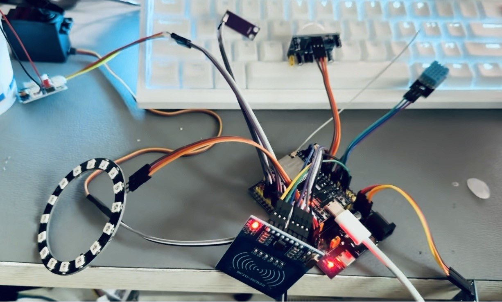

# 基于ESP32的智能化妆品收纳与环境管理系统

> 本科阶段的软硬件教学原型。ESP32 读取 DHT11、GUVA-S12SD（或兼容模拟 UV 模块）和 PIR；代码还保留 RFID 本地物品记录、OLED、低压灯带、风扇、加湿模块、舵机插销与 Flutter 局域网客户端的实验接口。

[](https://github.com/rongyishuaige7/esp32-smart-makeup-cabinet/actions/workflows/validate.yml)
[](LICENSE)

> [!CAUTION]
> 这是用于 ESP32、传感器采集、RFID 本地记录、低压执行器和 Flutter 局域网 HTTP 学习的教学原型。它不是化妆品质量、真假、过期真实性、皮肤健康、紫外线防护或医疗判断工具；不是门禁、电子锁、防盗、身份认证、访问控制、应急响应或无人值守系统。
>
> HTTP、App、CI、构建产物、固定阈值、OLED、命令字段和一次请求成功均不代表设备在线、网络持续可达、传感器准确、执行器已动作、舵机位置已到达、门已锁定/打开、化妆品可用或有人处理。

## 项目照片与资料

这里整理了项目照片、界面截图和相关资料；文件处理说明见 [MEDIA_EVIDENCE](docs/MEDIA_EVIDENCE.md)。



## 源码功能范围

```text
DHT11 / GUVA-S12SD 模块输出估算 / PIR / RFID 本地记录
  → ESP32 中的单次采样与本地状态变量
  → 可选：使用者明确 opt-in 的可信局域网 HTTP
  → Flutter 客户端的显式连接测试与本地展示

低压 WS2812B / 风扇驱动 / 加湿模块 / 舵机插销
  → 默认不执行实体动作；仅限受监督、低压台架实验 opt-in
```

- `climate` 为 `available` / `unavailable`；DHT11 本次不可用时 `temp` 与 `humid` 为 `null`，不是 `0`、正常或安全结论。
- `uvEstimate` 只说明源码是否给出未校准模块输出估算；`uv` 不是 UV 剂量、紫外线安全、护肤或健康判断。
- PIR 只是一次数字输入；不是人员存在、访问授权、安防或告警送达证明。
- RFID UID 可复制，不能作为身份、访问或安全凭据。公开 HTTP 不返回原始 UID；固件不根据刷卡自动命令插销。本地物品名称、品牌和手工录入日期都可能是个人数据。
- `/api/status` 中 `*Commanded*`、`latchCommandedClosed` 仅为软件命令状态。`localControlAndActuatorsEnabled` 只说明本地控制与执行器实验两个开关是否同时启用；`publicDefaultInert` 是其反值，不概括 RFID 维护、设备在线或物理输出。`physicalPositionVerified` 固定为 `false`，因为该设计没有位置、力矩、电流或驱动确认反馈。

## 硬件与电气边界

| 模块 / 信号 | ESP32 接口 | 源码可确认事实 | 实物仍需确认 |
| :-- | :-- | :-- | :-- |
| DHT11 | GPIO4 | 温湿度读取入口 | 模块、供电、上拉、线长、读数与失效路径 |
| GUVA-S12SD 或兼容模块 | GPIO34 | 模拟输入估算路径 | 型号、供电、输出摆幅、ADC 标定与电平 |
| PIR | GPIO5 | 数字读取入口 | 模块、电压、极性、延时与真实触发 |
| SSD1306 OLED | I²C GPIO21 / GPIO22 | 显示接口 | 地址、电压、上拉、总线质量 |
| RC522 | SPI GPIO18 / 19 / 23；SS GPIO2；RST GPIO15 | RFID 接口 | 电压、启动电平、接线和读卡行为 |
| WS2812B | GPIO27 | 灯带数据口 | 供电、逻辑电平、限流、外部电源、共地 |
| 风扇驱动 | GPIO26 / GPIO33 | 低压驱动逻辑 | 驱动板、极性、电流、保护与实际行为 |
| 加湿模块驱动 | GPIO25 | 低压控制逻辑 | 驱动、供电、电流、隔离和实际行为 |
| 舵机 | GPIO14 | 插销命令接口 | 独立供电、卡滞、夹伤、角度与机械位置 |

完整 [BOM](hardware/BOM.csv)、[源码推导接线边界图](hardware/wiring-diagram.svg) 和 [硬件说明](HARDWARE.md) 不是原理图、PCB、实物接线、制造文件或真机复测证明。接线前必须断电，确认实际额定电压、电流、电平、保护、公共地和负载能力。ESP32 GPIO/ADC 不得超过 3.3 V；不得用 GPIO 直接驱动风扇、加湿器、舵机、灯带或任何高电流/市电负载。

## 本地构建与受监督实验配置

### 1. 固件构建

```bash
git clone https://github.com/rongyishuaige7/esp32-smart-makeup-cabinet.git
cd esp32-smart-makeup-cabinet/firmware
python3 -m pip install 'platformio==6.1.19'
pio run -e esp32dev
```

该命令只下载上游构建依赖并编译；不会烧录硬件、连接 Wi-Fi、读取真实传感器或执行实体动作。

### 2. 可选：本地 Wi-Fi 与低压台架 opt-in

```bash
cd firmware/src
cp wifi_credentials.example.h config.local.h
# 仅在本机填写自己的可信局域网信息；按需保持所有实验宏为 0
```

`config.local.h` 被 Git 忽略。不要提交、截图、录屏、粘贴到 Issue 或写入日志。默认保持空凭据和所有实验宏为 `0`。只有使用者**自行**在隔离可信网络、受监督低压台架中明确 opt-in，同时将 `ENABLE_EXPERIMENTAL_ACTUATORS=1` 与 `ENABLE_EXPERIMENTAL_LOCAL_CONTROL=1` 写入本机 `config.local.h`，并确认接线、供电、急停和风险后，Wi-Fi/HTTP 或实验性执行器路径才可能启动；这不是认证、授权、安全边界或真机验证。

### 3. Flutter 客户端

```bash
cd mobile/smart_cabinet_app
flutter pub get --enforce-lockfile
flutter test
flutter analyze
flutter build apk --debug
```

客户端默认无地址、不会自动联网、不会后台轮询。它只接受无路径/查询/账号信息的 HTTP 私网或 loopback 地址，保存地址后还须显式读取 `/api/sensors` 与 `/api/status` 才在本会话显示“HTTP 读取成功”。Android debug APK 构建不是签名发布包、Android/iOS 真机验证、Wi-Fi 验证或硬件联调。普通 release manifest 不声明 `INTERNET` 或 cleartext 网络能力；debug/profile 为开发期本地 HTTP 演示保留 `INTERNET` 与 cleartext 权限，因此 debug APK 也不能被写成受限发布网络策略或真机联调的验证。

### 4. 一键公开门禁

```bash
bash scripts/verify.sh
```

脚本会运行公开范围扫描、仓库检查、源码契约、ESP32 PlatformIO 默认构建、双 opt-in 的仅编译覆盖，以及“仅执行器宏开启”时仍保持物理输出禁用的编译覆盖，并运行 Flutter 构建门禁；它在临时副本中编译固件，并清理本仓生成状态。所有编译覆盖都不会提供 Wi-Fi 凭据、不会烧录 ESP32、连接真实 Wi-Fi、访问真实设备、验证电气安全或证明执行器动作。

## 本地 HTTP API（可选）

HTTP 在公开默认构建中**不会启动**。只有本地 `config.local.h` 同时提供非空 Wi-Fi 信息，并设置 `ENABLE_EXPERIMENTAL_ACTUATORS=1` 与 `ENABLE_EXPERIMENTAL_LOCAL_CONTROL=1`，且 ESP32 成功加入网络，端口 `80` 才可能启动无认证、无 TLS、无访问控制、无审计、无设备身份、无速率限制的明文 HTTP 服务。

它只能用于隔离、可信、短期、受监督的教学局域网。禁止公网暴露、端口转发、公共 Wi-Fi、共享热点或不可信网络。项目不提供公网部署、远程控制、门锁、安全或生产使用方案。

| 方法 | 路径 | 当前源码行为 | 不代表 |
| :-- | :-- | :-- | :-- |
| `GET` | `/api/sensors` | 单次传感器报告 | 设备在线、传感器准确、环境/健康/UV 结论 |
| `GET` | `/api/status` | 软件命令变量，以及仅针对本地控制与执行器双开关的标记 | 执行器已动作、舵机位置、门锁或持续可达 |
| `POST` | `/api/led`、`/api/fan`、`/api/humidifier`、`/api/latch` | 仅在执行器与本地控制两个实验开关均精确设为 `1` 时返回 `accepted:true` | 物理动作、命令送达、机械安全或成功执行 |
| `GET/POST` | `/api/settings` | 读取或写入本地阈值变量 | 适宜环境、自动控制安全或可靠运行 |
| `GET` | `/api/rfid/list` | 本地物品记录（不含 UID） | 商品真实性、日期真实性、化妆品安全 |
| `POST` | `/api/rfid/register` | 仅实验性 RFID 维护路径可能接受记录 | RFID 安全、身份认证或门禁 |
| 任意 | 未知路径 | `404` JSON `{"accepted":false,"error":"not_found"}` | 网络安全、认证或远程控制能力 |

完整字段、响应和失败边界见 [PROTOCOL](docs/PROTOCOL.md)。HTTP `200` 或 `accepted:true` 只表示当前 handler 返回/接受了该请求，不表示物理输出、设备状态或实际结果。

## 公开范围、验证与来源

- 原始桌面工程保持只读；本公开仓将凭据拆分到被忽略的本地配置，并排除缓存、IDE 状态、构建物与发行 APK。
- 当前未公开实物照片、视频、屏幕截图、原理图、PCB、Gerber、制造文件、真实日志、真实传感器数据、Wi-Fi 信息、局域网地址或客户资料。
- 当前 CI 与门禁只验证公开文件边界、源码契约和固定构建配置；不验证 ESP32、DHT11、GUVA 模块、PIR、RFID、OLED、低压负载、Wi-Fi、HTTP、Android/iOS 或端到端行为。

详见 [SOURCE_PROVENANCE](docs/SOURCE_PROVENANCE.md) 与 [HARDWARE_LAB_CARD](docs/HARDWARE_LAB_CARD.md)。

## 开源许可、第三方组件与问题报告

Rongyi 自有的公开源码、文档、BOM 和接线边界图以 [MIT License](LICENSE) 发布。构建所需的 ESP32 Arduino 框架、PlatformIO、Flutter SDK 和上游库由使用者自行取得；当前已核验和待复核项见 [THIRD_PARTY_NOTICES](THIRD_PARTY_NOTICES.md)。

完整限制见 [SECURITY](SECURITY.md)。报告问题时不要公开 Wi-Fi 凭据、私网 IP/MAC、位置、个人物品记录、日期、照片 EXIF/GPS、网络抓包、串口日志、真实传感器数据或其他敏感材料。
